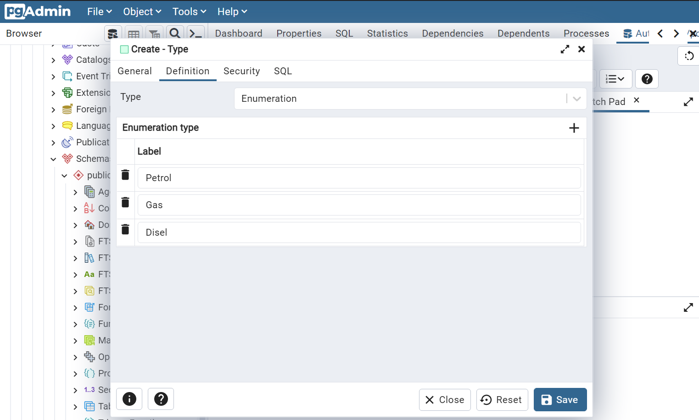
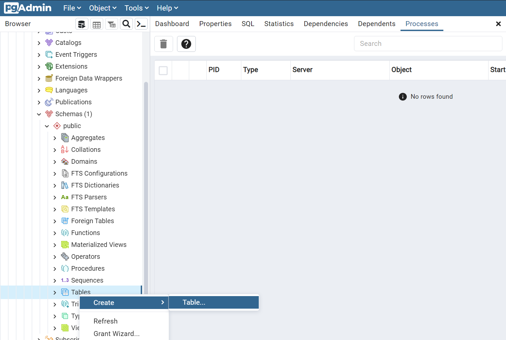
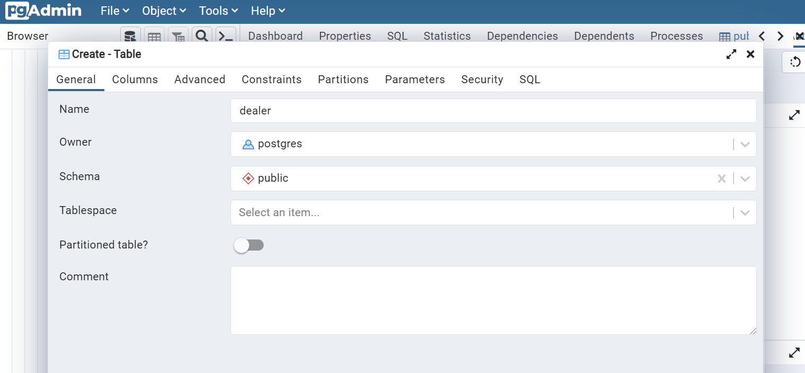
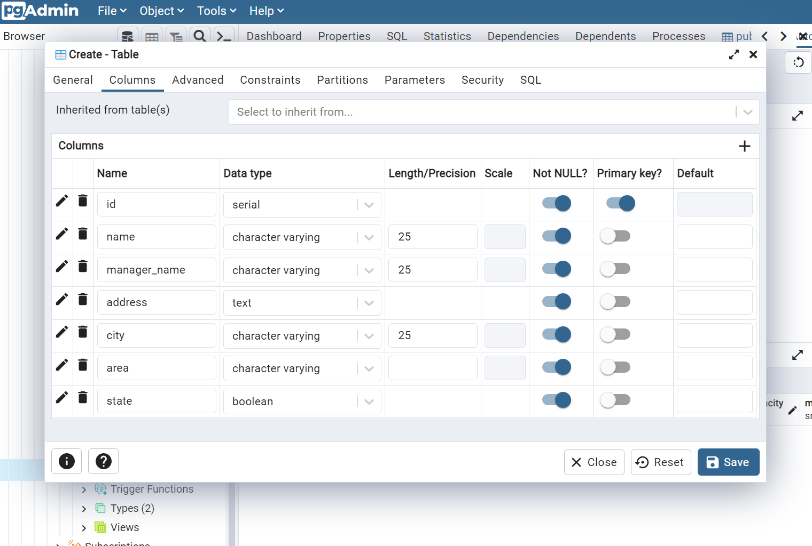
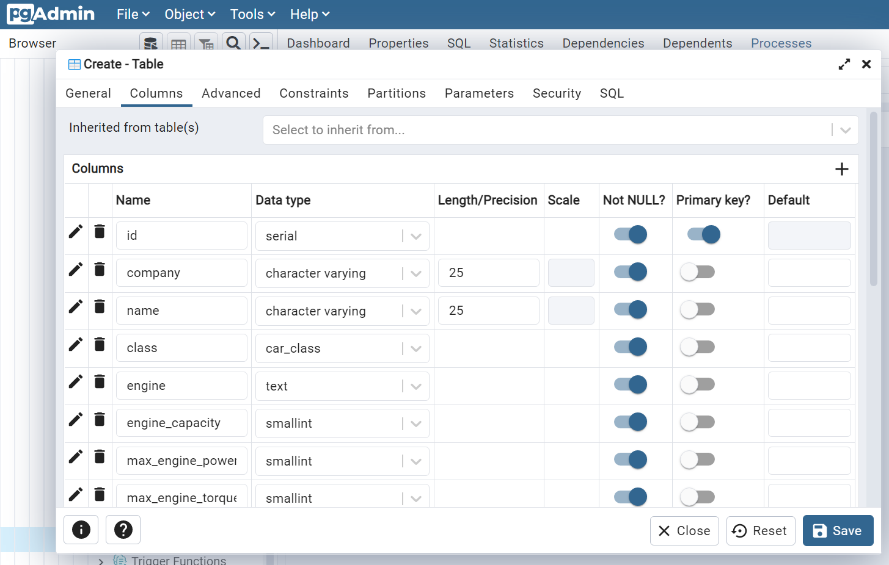
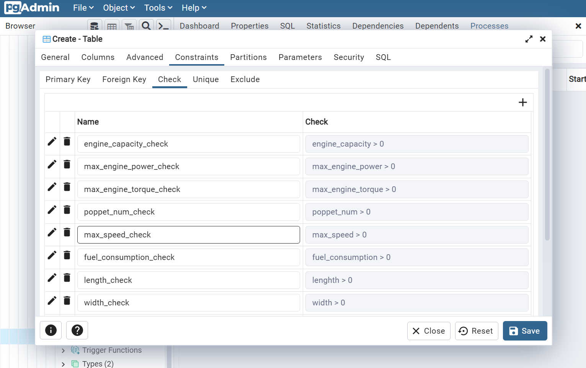

<div dir="auto">

# گزارش تمرین اول آز پایگاه داده

گروه 8

امیرمحمد عزتی 980122680012  
سید امیر کسائی 980122680021  
<br  />

## الف) صفات خودرو و نمایندگی فروش، بر اساس سایت ایران خودرو در نظر گرفته شده است.


### **صفات خودرو**

- نام خودرو
- شرکت سازنده
- کد کلاس(های) خودرو
- نوع موتور
- حجم موتور (cc)
- حداکثر توان موتور (hp)
- حداكثر گشتاور (Nm)
- تعداد سوپاپ
- نوع سوخت سازگار
- حداکثر سرعت (km/h)
- سيستم انتقال قدرت
- مصرف سوخت تركيبي (Lit/100 km)
- طول خودرو (mm)
- عرض خودرو(mm)
- ارتفاع خودرو (mm)
- وزن خودرو (kg)
- گنجايش مخزن سوخت (Lit)
- حجم فضاي صندوق عقب (Lit)
- قیمت

### **صفات نمایندگی فروش:**

- نام نمایندگی
- کد نمایندگی
- نام مدیر نمایندگی
- آدرس
- دفتر منطقه‌ای (شهر)
- منطقه فروش
- وضعیت نمایندگی

---

## ب) ایجاد پایگاه داده


روی `Databases` راست کلیک کرده و از منوی `Create`، گزینه `Database` را انتخاب می کنیم تا پنجره زیر باز شود.


در قسمت `Database`، نام پایگاه داده و در قسمت `Comment`، توضیح مختصری در مورد آن می نویسیم و آن را ذخیره می کنیم.  
کد مربوط به عملیات بالا:

```sql
CREATE DATABASE "Automobile"
    WITH
    OWNER = postgres
    ENCODING = 'UTF8'
    CONNECTION LIMIT = -1
    IS_TEMPLATE = False;

COMMENT ON DATABASE "Automobile"
    IS 'Database for Cars and Dealers';
```

---

## ج) تعریف ستون ها و نوع داده آن ها و ایجاد جداول

- در جدول خودرو، برای صفت های کلاس خودرو و نوع سوخت، دو نوع داده از نوع `ENUM`، ایجاد می کنیم.


- برای این کار از منوی `Create` ،`Types` و سپس `Type` را انتخاب می کنیم.


- در قسمت `Database`، نام پایگاه داده و در قسمت `Comment`، توضیح مختصری در مورد آن می نویسیم.



- در قسمت `Definition`، نوع `Type` و `Label` های آن را وارد می کنیم و آن را ذخیره می کنیم.  
  کد مربوط به عملیات بالا:

```sql
CREATE TYPE public.car_class AS ENUM
    ('A (segment mini cars)', 'B (segment small cars)', 'C (segment medium cars)', 'D (segment large cars)', 'E (segment executive cars)', 'F (segment luxury cars)', 'S (segment sports coupés)', 'M (segment multi purpose cars)', 'J (segment sport utility cars)');

ALTER TYPE public.car_class
    OWNER TO postgres;

COMMENT ON TYPE public.car_class
    IS 'different type of car classes';

```

```sql
CREATE TYPE public.car_fuel AS ENUM
    ('Petrol', 'Gas', 'Disel');

ALTER TYPE public.car_fuel
    OWNER TO postgres;

COMMENT ON TYPE public.car_fuel
    IS 'different types of car fuel';

```

- حال می توانیم جداول را ایجاد کنیم. برای ایجاد جدول از منوی `Tables`، `Create` و سپس `Table` را انتخاب می کنیم.



- در قسمت نام، نام جدول را می نویسیم.




- در قسمت `Columns`، مشخصات هر ستون(صفت) به همراه نوع داده، محدودیت های آن و ... را وارد می‌کنیم.





- کد عملیات بالا:

```sql
CREATE TABLE public.car
(
    id serial NOT NULL,
    company character varying(25) NOT NULL,
    car_name character varying(25) NOT NULL,
    car_class car_class NOT NULL,
    engine text NOT NULL,
    engine_capacity smallint NOT NULL,
    max_engine_power smallint NOT NULL,
    max_engine_torque smallint NOT NULL,
    poppet_num smallint NOT NULL,
    fuel car_fuel NOT NULL,
    max_speed smallint NOT NULL,
    gearbox text NOT NULL,
    fuel_consumption double precision NOT NULL,
    car_length smallint NOT NULL,
    car_width smallint NOT NULL,
    car_height smallint NOT NULL,
    car_weight smallint NOT NULL,
    fuel_capacity smallint NOT NULL,
    trunk_capacity smallint NOT NULL,
    price integer NOT NULL,
    PRIMARY KEY (id),
    CONSTRAINT engine_capacity_check CHECK (engine_capacity > 0),
    CONSTRAINT max_engine_power_check CHECK (max_engine_power > 0),
    CONSTRAINT max_engine_torque_check CHECK (max_engine_torque > 0),
    CONSTRAINT poppet_num_check CHECK (poppet_num > 0),
    CONSTRAINT max_speed_check CHECK (max_speed > 0),
    CONSTRAINT fuel_consumption_check CHECK (fuel_consumption > 0),
    CONSTRAINT car_length_check CHECK (length > 0),
    CONSTRAINT car_width_check CHECK (width > 0),
    CONSTRAINT car_height_check CHECK (height > 0),
    CONSTRAINT fuel_capacity_check CHECK (fuel_capacity > 0),
    CONSTRAINT trunk_capacity_check CHECK (trunk_capacity > 0),
    CONSTRAINT price_check CHECK (price > 0) NOT VALID
);

ALTER TABLE IF EXISTS public.car
    OWNER to postgres;

COMMENT ON COLUMN public.car.engine_capacity
    IS 'in cc';

COMMENT ON COLUMN public.car.max_engine_power
    IS 'in hp';

COMMENT ON COLUMN public.car.max_engine_torque
    IS 'in Nm';

COMMENT ON COLUMN public.car.max_speed
    IS 'in km/h';
```

```sql
CREATE TABLE public.dealer
(
    id serial NOT NULL,
    dealer_name character varying(25) NOT NULL,
    manager_name character varying(25) NOT NULL,
    address text NOT NULL,
    city character varying(25) NOT NULL,
    area character varying NOT NULL,
    dealer__state boolean NOT NULL,
    PRIMARY KEY (id)
);

ALTER TABLE IF EXISTS public.dealer
    OWNER to postgres;
```

- جداول ایجاد شده


---

## د) افزودن چند سطر به جداول

- با استفاده از کد های زیر، داده به جداول `car` و `dealer` اضافه می کنیم:

```sql
INSERT INTO car (
    company,
    model,
    car_class,
    engine,
    engine_capacity,
    max_engine_power,
    max_engine_torque,
    poppet_num,
    fuel,
    max_speed,
    gearbox,
    fuel_consumption,
    car_length,
    car_width,
    car_height,
    car_weight,
    fuel_capacity,
    trunk_capacity,
    price) VALUES (
        'IKCO',
        '206',
        'A (segment mini cars)',
        'TU3A',
        1360,
        75,
        118,
        8,
        'Petrol',
        170,
        '5-speed manual',
        6.4,
        3835,
        1652,
        1426,
        1025,
        50,
        245,
        150000000
    );
```

```sql
INSERT INTO dealer (
    dealer_name,
    manager_name,
    dealer_address,
    city,
    area,
    dealer_state) VALUES (
        'Fathi',
        'Ali Fathi',
        'Tehran, Valiasr St.',
        'Tehran',
        'area 1',
        true
    );
```


---

## ه) با توجه به محدودیت های تعریف شده، چند مورد داده نادرست وارد جدول می کنیم.

- در جدول خودرو، قیمت، ابعاد ماشین، حجم موتور و ... باید بزرگ¬تر از صفر باشند. برای نمونه، قیمت خودرو را صفر وارد می کنیم.

```sql
INSERT INTO car (company, model, car_class, engine, engine_capacity, max_engine_power, max_engine_torque, poppet_num, fuel, max_speed, gearbox, fuel_consumption, car_length, car_width, car_height, car_weight, fuel_capacity, trunk_capacity, price) VALUES ('IKCO', '405', 'A (segment mini cars)', 'TU7', 1587, 105, 142, 16, 'Petrol', 210, '5-speed manual', 6.4, 3835, 1652, 1426, 1025, 50, 245, 0);
```


همانطور که در خروجی مشخص است، خطای داده شده مربوط به مقدار نادرست قیمت خودرو است.

- در جدول نمایندگی، طول نام صاحب نمایندگی باید حداکثر 25 کاراکتر باشد. برای نمونه، این مقدار را با بیش از 25 کاراکتر وارد می کنیم.

```sql
INSERT INTO dealer (dealer_name, manager_name, dealer_address, city, area, dealer_state) VALUES ('Mozaffari', 'Aeyed Amir Mohammad Mozaffari Zade guilani', 'Tehran, Niavaran St.', 'Tehran', 'area 1', true);
```


همانطور که در خروجی مشخص است، خطای داده شده مربوط به مقدار نادرست طول نام نمایندگی است.

---

## ن) نشان دادن سطر های جداول

- با استفاده از دستور زیر، همه، سطرهای جدول خودرو را نمایش می دهیم. داده ها بر اساس `id`، از کوچک به بزرگ مرتب شده اند.


```sql
SELECT * FROM public.car
ORDER BY id ASC
```

- با استفاده از دستور زیر، همه، سطرهای جدول نمایندگی را نمایش می دهیم. داده ها بر اساس `id`، از کوچک به بزرگ مرتب شده اند.


```sql
SELECT * FROM public.dealer
ORDER BY id ASC
```

</div>
